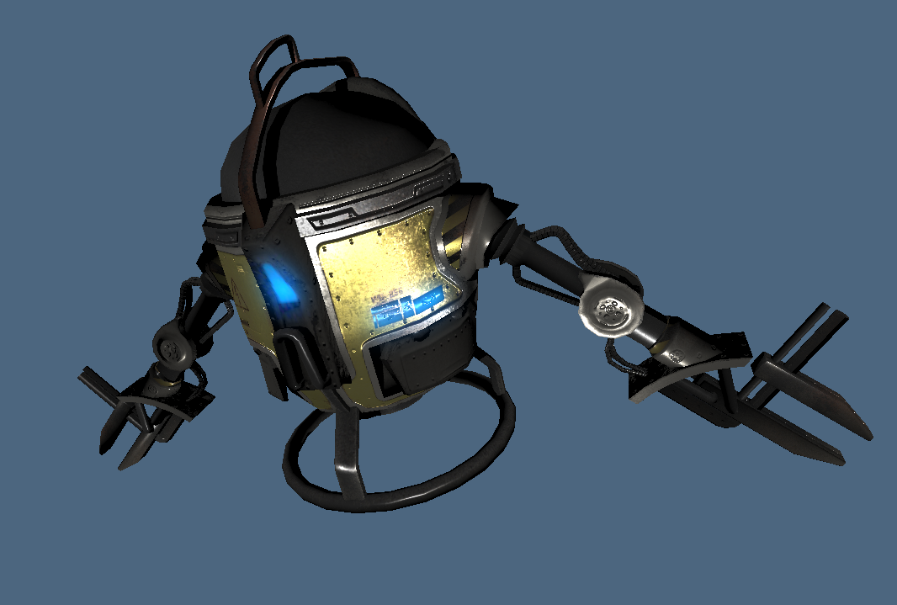

# Projet de synthèse d'image : Viewer GLTF 2.0
### Kévin Trancho - Victor Veillerette



### Compilation et exécution

Le projet est situé dans le dossier `apps/app`.
Un CMakesList est fourni, ce qui permets de compiler et executer facilement :
```bash
mkdir build
cd build
cmake ..
make -j
./bin/app
```

Par défault, la scène `drone/scene.gltf` s'ouvre, mais il est possible de spécifier la scène en ligne
de commande :
```
./bin/app scenes/BoxAnimated/BoxAnimated.gltf
```

### Fonctionnalités implémentées :

* Toutes les fonctionnalités de base demandées :
  * Chargement d'un fichier gltf
  * Caméra trackball initialisée en fonction de la scène
  * Lumière directionnelle
  * ShadowMap avec PCF
  * Correction Gamma
  * Matériaux Diffus + Emission
* (Avancé) Modèle de shading PBR
* (Avancé) Normal mapping (Exemple: `drone/scene.gltf`)
* (Avancé) Bloom (Exemple: `drone/scene.gltf`)
* (Avancé) Animations sur GPU (Exemple: `BoxAnimated.gltf`)

### Paramètres du GUI

Le GUI permet de modifier de nombreux paramètres comme :

 * L'affichage des différentes couches du GBuffer ou l'affiche complet
 * La lumière directionnelle
 * Les paramètres de la ShadowMap (résolution et biais)
 * Les paramètres du Bloom (nombre d'itérations et puissance)
 * Les paramètres par défaut PBR
 * Le lancement/arrêt des animations

### Problèmes rencontrés

Voici une liste des problèmes encore à résoudre :

 * Problèmes avec les animations sur certains modèles
 * Normal map non utilisée si les tangentes ne sont pas définies dans le modèle
 
### Modèles testés

Nous avons principalement tester notre projet avec la scène `drone/scene.gltf` vu que c'est un modèle très complet. 

Nous fournissons également d'autres scènes de test dans le dossier `scenes/` qui se chargent toutes
correctement. (Attention, la scène `robot/scene.gltf` est très lourde).
